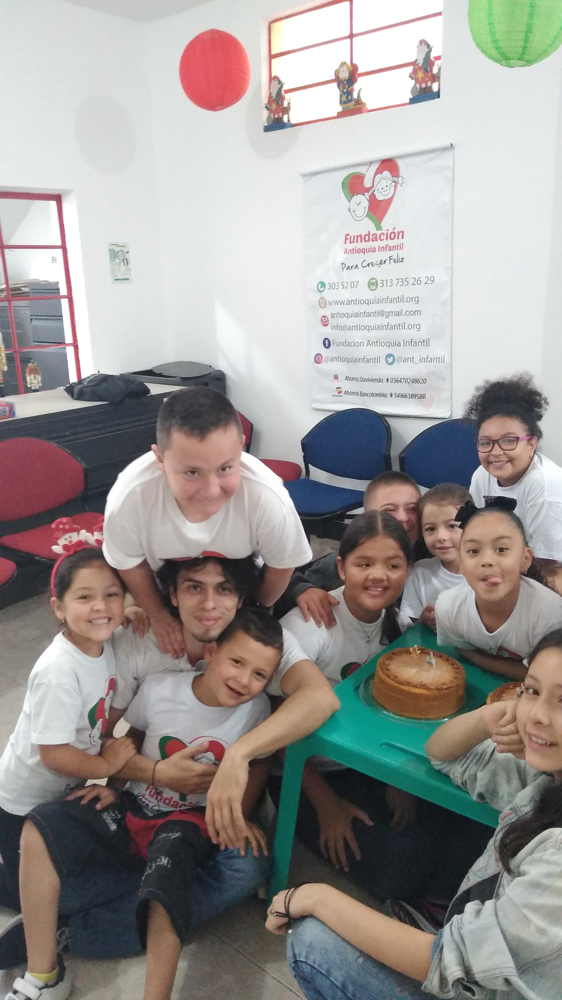
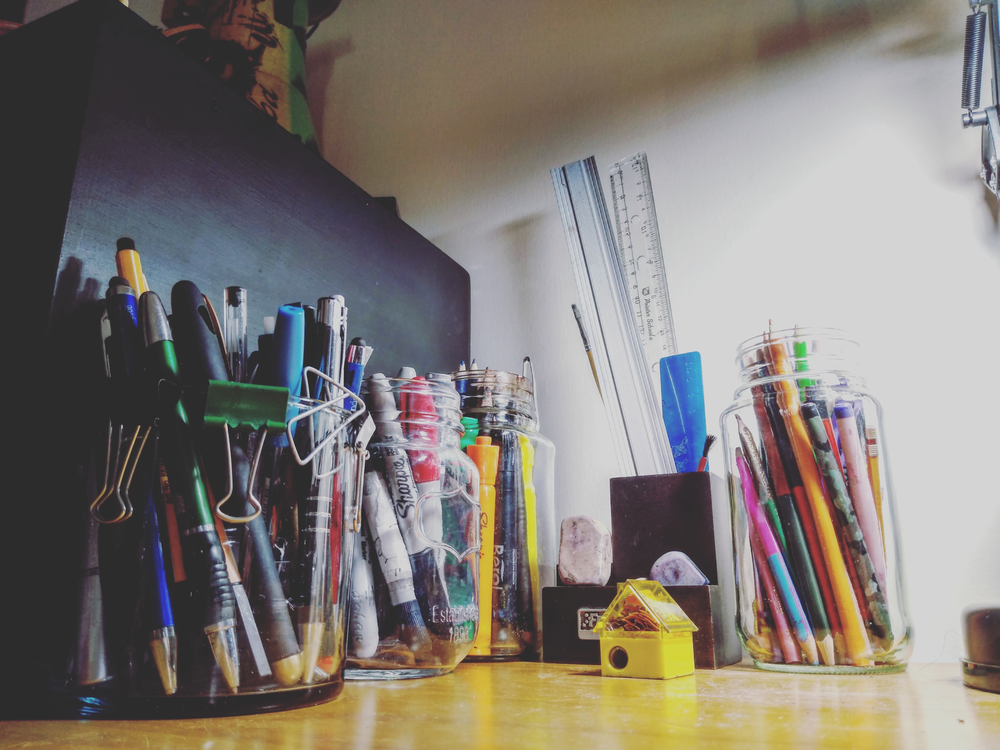
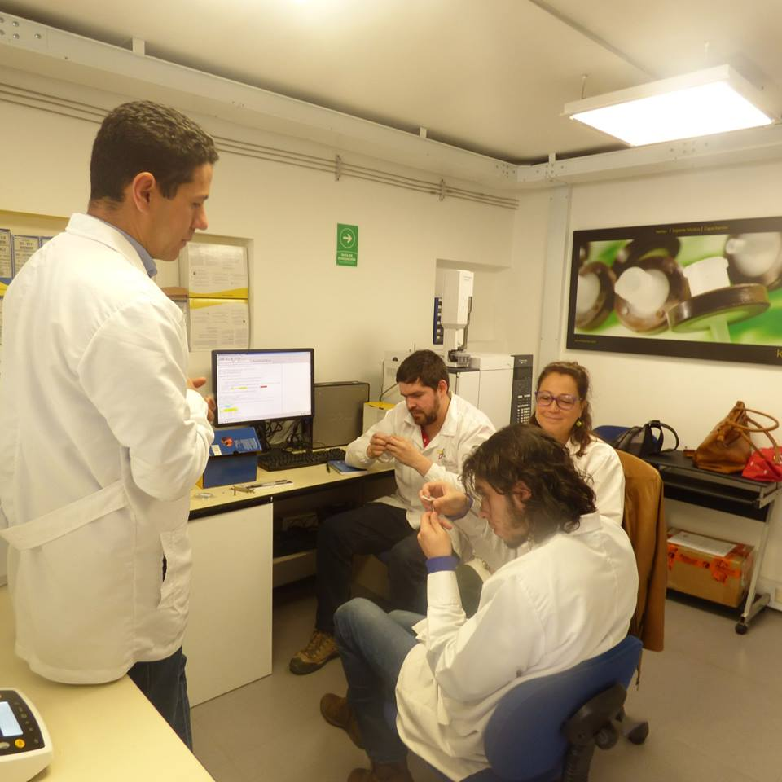

# Portfolio
This repository is for create a custom front page on github profile. As a full review of my learning process, projects and about me.

# About my self

Always learning for the love of learning, artist for passion, chemist by profession, and data scientist progressing toward mastery.

The leitmotif of my life is to learn, create and share with everyone as an exercise in learning and personal growth, I believe in the power of science and technology but I am also aware of the gap between who thinks and who decides, I think of myself as a bridge builder between this gap, someone who loves software development, cognitive neurosciences, literature and believes that if knowledge is power, data is potential.

  <a href="https://www.linkedin.com/in/alejandrosin/"><a href="https://www.linkedin.com/in/alejandrosin/"><a href="https://www.linkedin.com/in/alejandrosin/"><a href="https://www.linkedin.com/in/alejandrosin/"><a href="https://www.linkedin.com/in/alejandrosin/"><a href="https://www.linkedin.com/in/alejandrosin/"><a href="https://www.linkedin.com/in/alejandrosin/"><a href="https://www.linkedin.com/in/alejandrosin/">

# Status

    
    

# Projects

### Data_Science

* [Web Scraper ...](): Data collection from diferents sources
* [Data visualization](): The visualization of ...
* [The Data Science Awareness](): Divulgation proyect...

## Fullstack

* [Digitalizer](): Team project at [Platzi Master]()
* [Google Clone](): Practicing skills...
* [NIO](): Educational project...

# Experience

* Presente
* Pasado
  

# Education and Certification

<table>
  <tr></tr>
    <th>Course</th>
    <th>Type</th>
  </tr>

